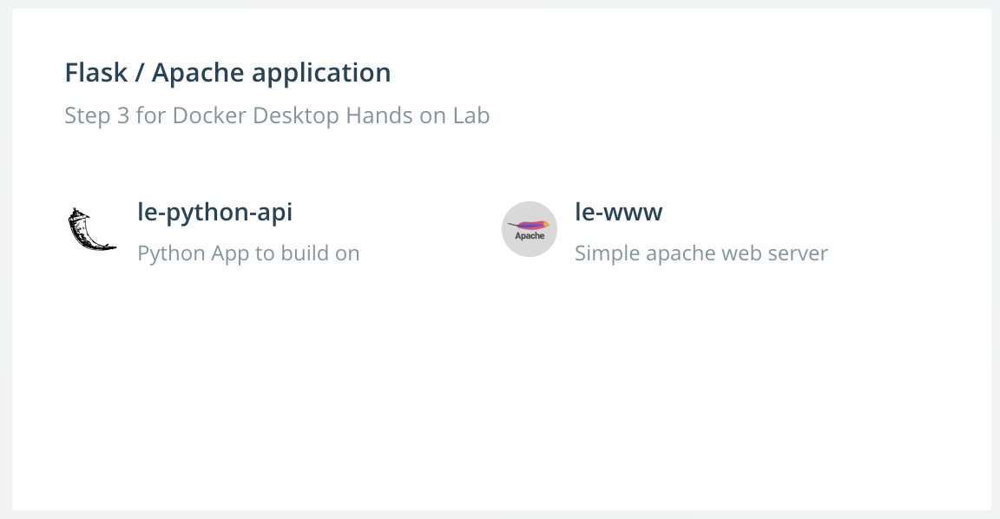

# DDE Hands on Lab: Lab Setup

If you are following this lab within a Docker sponsored classroom environment
there is no setup required. The wonderful elves have done it for you :)

If you are doing this lab as a lone ranger you will need to set up a few things.

## Docker Desktop Enterprise

These labs were written for Docker Desktop Enterprise. Please make sure you have Docker Desktop Enterprise setup and configured on your
environment. You can also use Docker Desktop Community, but some steps will not apply. For more details see:
* Windows:
  * [Docker Desktop Enterprise on Windows](https://docs.docker.com/ee/desktop/admin/install/windows/)
  * [Docker Desktop on Windows](https://docs.docker.com/docker-for-windows/install/) or
* macOS
  * [Docker Desktop Enterprise for macOS](https://docs.docker.com/ee/desktop/admin/install/mac/)
  * [Docker Desktop for macOS](https://docs.docker.com/docker-for-mac/install/)

## Git Clone the Repo

For the best experience with this lab it is advised to a have a local copy of
all of the guides. Therefore we advise users to `clone` this repository locally
and then work through it.

```bash
git clone https://github.com/ollypom/dde-handsonlab
```

## Application Designer Library

The Docker Desktop Enterprise Application Designer is configured with a stock
library of application templates. You will need to add an additional custom
library for this hands on lab.  Edit the library configuration file in a text editor

The library configuration file is located at:

   * `/Users/<user>/.docker/application-template/preferences.yaml`
   * `C:\Users\<user>\.docker\application-template\preferences.yaml`

   You need to add a new repository, which is shown below as the `custom-services` repository. The file should look like this when you're done:

   ```yaml
   apiVersion: v1alpha1
   disableFeedback: true
   kind: Preferences
   repositories:
   - name: custom-services
     url: https://raw.githubusercontent.com/ollypom/dde-handsonlab/master/labsetup/appdesignertemplates/library.yaml
   - name: library
     url: https://docker-application-template.s3.amazonaws.com/production/v0.1.5/library.yaml
   ```

If you've done all the set-up correctly you should be able to click your Docker Desktop Enterprise icon (Moby whale), then `Design new application...`, then when Application Designer appears you can click `Choose a template` and you should see this template:


## Enjoy!

You are good to go. Enjoy!

## Issues
Please submit issues / PRs if you find ways to improve the lab :)
