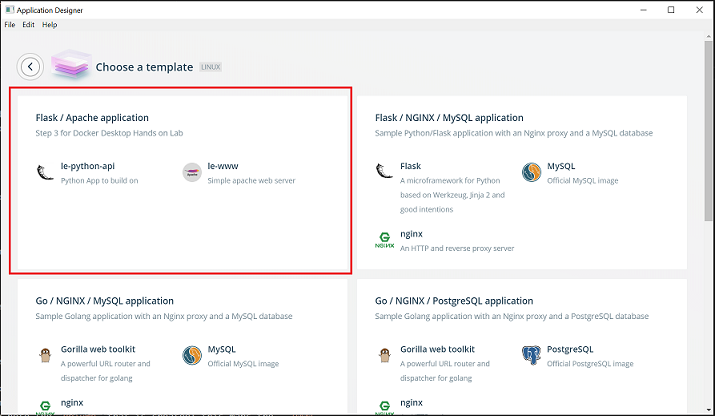
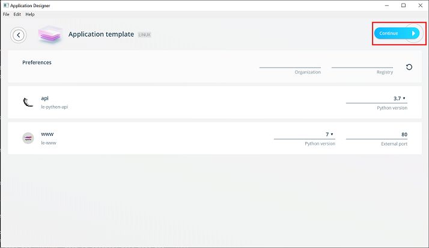
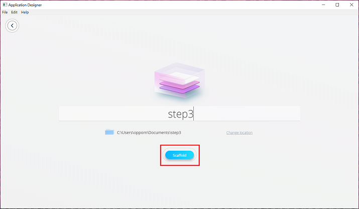
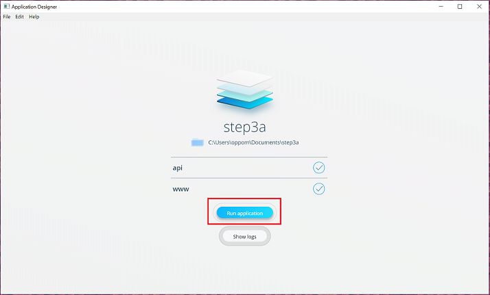
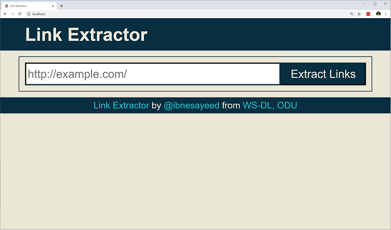
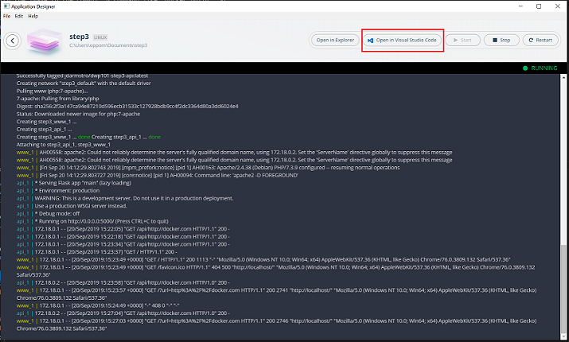
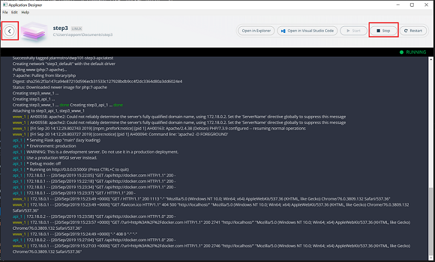
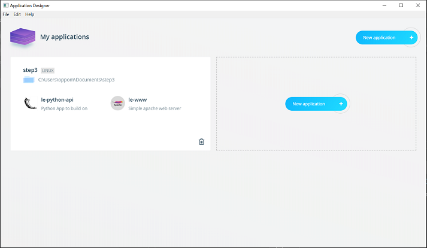

# Link Extractor: Step 3 - Docker Templates

In this step we see a different way to cycle through a typical inner loop
code-build-test cycle. In previous steps you made some code edits, then rebuilt
the container and ran it again. There are plenty of tools that can automate that process for you, but it's not always necessary. Here you will see how to live test code changes
without rebuilding the container each time.

You will also add a web front-end service to the application so it can serve up
both API and HTML endpoints. This requires running two services (2 different
containers) so you will use Docker Compose (`docker-compose.yml`) to define the services
and enable the Docker engine to run both services together.

Notice that at this point, the `step3` directory is pretty empty. There is no Python code and no Dockerfile. This time, we will leverage Docker Application Designer and Docker Templates to
scaffold all the code and files to build our application.

## Changes from the previous step

* The link extractor JSON API service (written in Python) is moved in a
  separate folder
* A web front-end application is written in PHP that talks to the JSON API
* The PHP application is mounted inside the official `php:7-apache` Docker
  image for easier modification during the development
* The web application is accessible at
  `http://<hostname>[:<prt>]/?url=<url-encoded-url>`
* An environment variable `API_ENDPOINT` is used inside the PHP application to
  configure it to talk to the JSON API server
* A `docker-compose.yml` file is written to build various components and glue
  them together

## Try it out

1. Open up the Docker Application Designer, select `Choose a Template`, `Linux`
   and select `Flask / Apache application` - it should be the first template listed if you followed the Lab Setup instructions. It could also be the last template listed, depending on the order of the Library file you added.
   
    
    

   * Please keep the default values for the Python and Apache version, but note that these can be parameterized to make them selectable.
      * Almost any setting in the Dockerfile and Compose files can be parameterized in this way. We'll look at Docker App parameters in later steps, but we will not be covering Template creation in these labs.
   * By default the Application will be stored in `C:\Users\<user>\Documents\` on Windows or `~/Documents/` on macOS.

2. Name the application and select `Scaffold`

    

    * Once the scaffolding is complete, you can see all the files that were created in the folder you entered above. There is an `api` directory, which is where your Python code for the linkextractor now sits, and a `www` folder, which is the fancy new web front-end. You'll see a Dockerfile and a docker-compose.yml file in the tree as well. The Docker Template has created all of this for you.
    * Templates are often used to hold skeleton code along with the files Docker needs to run your application. You can put almost anything you want in a Template, include IDE plug-ins, documentation, etc.
    * Later you can try clicking through some of the other built-in templates to get an idea of what's possible.

3. Once the Application Designer has downloaded the container images, extracted
   out the application files. You can `Run` the application, directly from the
   UI.

    

   * The `api` service will `build` from a Dockerfile in the `./api` directory
     and when running will expose port 5000 externally and map it to port 5000
     in the container. You'll see the logs for this in the Application Designer window - it looks very much like what you saw when you manually built and ran the Docker image yourself.

   * The `web` service uses the Official PHP image from _Docker Hub_ and so it does not require a `build`. It will be listening on port 80 and also creates an environment variable in the container that passes the API endpoint location; you can inspect the code in `www/web/index.php` to see how this env var is consumed. 
      * If you check out the `docker-compose.yaml` file you should also notice that a `volume` is created: this maps the `./www/web` directory on your system to the `/var/www/html` directory inside the container:

```yaml
    volumes:
    - ./www/web:/var/www/html
```

      * This configuration will enable us to continue editing the index.php file and see those changes live in our running container - no repetitive `docker build` required!

   4. Open [localhost](http://localhost) in a web browser and give your new web
   front-end a spin.  You can also still access the API directly. For example,
   [](http://localhost:5000/api/http://docker.com).

   

4. A Docker Template creates a full directory structure containing all
   components of the application, a Dockerfile for each micro service, a
   `docker-compose.yml` file and a docker-app file. We will use the docker app
   more in Step 4.

   Open up the directory where your application has been extracted too, and
   follow the rest of this guide from that location.

   

5. Now make some changes to the index.php web page to see how live editing works:

   * Try searching for "Link Extractor" and replacing it with "Super Link
     Extractor T-1000". There should be 3 instances of "Link Extrator" in the
     original code. Save the file and then refresh the web page (not the API page).
     You should immediately see the text changes in the web page.

   * Try changing some of the colors in the CSS. For example, search for the
     `background:` style in the `html{}` selector and change the color to
     `#E9EBEE`. Refresh again and you should see the changes immediately.

## The new dev-test inner loop

Mounting the source code directly in the container is fast way to iterate and test your changes, particularly for interpreted languages like PHP, Python, Ruby, etc. 

You can also live debug compiled languages like Java, but that's for [another workshop](https://blog.docker.com/2016/09/java-development-using-docker/).

Once you're done with your local testing you can commit your code to your SCM of choice. Usually that kicks of a CI tool, which will build Docker images in much the same way you did on your own machine, run through your tests, and then create images that can be used for deployment.

These images can be digitally signed, to authenticate their contents and the fact that they've passed your CI tests. Images can also be scanned, which pulls apart all the layers and binaries in your image and checks them against the Mitre CVE database. 

## Other considerations

* In the workshop you tagged files with a simple semantic version: v1, v1.1, v2, etc. That worked fine since everything is local and you're working alone.
* When you're working with a team and sharing images and code, this simple tagging scheme will probably cause problems:
  * if two people have create a version tagged `v3` and then try to share those container images how will you know which is the real v3?
* Plus, since you're hopefully using some kind of central source code repo, you'll likely want to match up a particular image with a particular commit of your code as well, instead of just assigning an arbitrary version.

* There are many options and opinions for tagging but one relatively simple method is to tag the image using the git hash of your last commit. This will help you match the image to the commit. A command like `docker build . -t linkextractor_api:$(git log -1 --format=%h)` will automatically use the shortened git hash to tag the image. 
  * You can try it by changing to the api directory and running this command. Use `docker image ls linkextractor_api` to see the resulting image.
  * NOTE: You might need to do a `git init`, `git add -A`, and `git commit` before the `docker build` command.

## Cleanup

Stop the application in the app designer

  

Press Go Back to the My Applications Screen.

  

You're now ready to proceed to Step 4:
`cd ../step4`