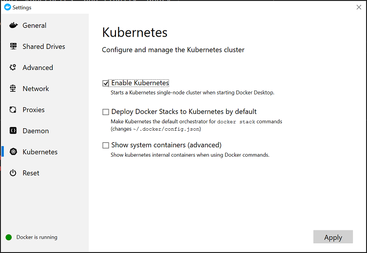

# Link Extractor: Step 5 - Using Kubernetes Locally

In Step 4 we started using Docker App locally against a 1 node Docker Swarm
cluster to see how we can package our new microservice based application. Docker
Desktop Enterprise actually ships with 2 container orchestrators in the box.
Docker Swarm and Kubernetes. In this step we will use a new packaged micro
service with Kubernetes.

## Try it out

1) To enable Kubernetes on Docker Desktop Enterprise, *right-click* the whale in
   the system tray, and click *Settings*. Click *Kubernetes* on the left hand
   navigation bar. Tick *Enable Kubernetes* and finally *apply*.
   
   > Note this may take 1 or 2 minutes for Kubernetes to start.
   
     
   
   To verify that Kubernetes is running successfully, we can use the Kubernetes
   command line tool `kubectl` which is installed by Docker Desktop Enterprise.
   
   ```powershell
   > kubectl get nodes
   NAME             STATUS   ROLES    AGE   VERSION
   docker-desktop   Ready    master   3m    v1.14.6
   
   > kubectl get componentstatus
   NAME                 STATUS    MESSAGE             ERROR
   scheduler            Healthy   ok
   controller-manager   Healthy   ok
   etcd-0               Healthy   {"health":"true"}
   ```

2) Now that Kubernetes is up and running, we are able to take our Link Extractor
   application and install it straight on to Kubernetes. Docker Desktop
   Enterprise is able to convert a Docker Compose file into Kubernetes objects.

   Navigate into the linkextractor.dockerapp directory and run:

   ```powershell
   > docker app install --name linkextractor --orchestrator kubernetes .
   Waiting for the stack to be stable and running...
   api: Pending
   www: Pending
   www: Ready
   api: Ready
   
   Stack linkextractor is stable and running
   
   Application "linkextractor" installed on context "default"
   ```
   
   > the `--orchestrator` flag allows us to switch between the local Docker
   > Swarm and Kubernetes Cluster.

   Once again you can open the web browser and navigate to "http://localhost"

3) Our application is now successfully running on Kubernetes. We can inspect the
   Kubernetes objects such as Pods and Services to see more about the
   application.

   ```powershell
   > kubectl get deployments
   NAME   READY   UP-TO-DATE   AVAILABLE   AGE
   api    1/1     1            1           6m37s
   www    1/1     1            1           6m37s
   ```

   ```powershell
   > kubectl get pods 
   NAME                   READY   STATUS    RESTARTS   AGE
   api-6cb55cf4-dcpzf     1/1     Running   0          5m4s
   www-659785ff67-zk2xl   1/1     Running   0          5m4s
   ```

   ```powershell
   > kubectl get services
   NAME            TYPE           CLUSTER-IP       EXTERNAL-IP   PORT(S)          AGE
   api             ClusterIP      None             <none>        55555/TCP        5m24s
   api-published   LoadBalancer   10.108.251.216   localhost     5000:30494/TCP   5m24s
   kubernetes      ClusterIP      10.96.0.1        <none>        443/TCP          10m
   www             ClusterIP      None             <none>        55555/TCP        5m24s
   www-published   LoadBalancer   10.97.129.99     localhost     80:32330/TCP     5m24s
   ```

   We can see that a single pod has been deployed for each micro service, and
   then using a Kubernetes Service to communicate between micro services, and to
   expose the application to the outside world.

4) Once again, we can use Docker App to upgrade our application even if it is
   running on Kubernetes. Similar to Step 4, we will use the `upgrade` sub
   command, but this time we will use it to upgrade the App version. So far, we
   are on Docker App `0.1.0`, but in this directory there is a `0.2.0` of the
   app called `linkextractor2.dockerapp`.

   ```powershell
   > docker app upgrade --app-name linkextractor2.dockerapp linkextractor
   Waiting for the stack to be stable and running...
   www: Ready
   api: Ready
   
   Stack linkextractor is stable and running
   
   Application "linkextractor" upgraded on context "default"
   ```

   We can make sure it's version `0.2.0` by running the `docker app status` sub
   command.

   ```powershell
   > docker app status linkextractor
   INSTALLATION
   ------------
   Name:                 linkextractor
   Created:              5 minutes
   Modified:             4 minutes
   Revision:             01DND325AESAKKAX2850JM6SS0
   Last Action:          upgrade
   Result:               SUCCESS
   Orchestrator:         kubernetes
   Kubernetes namespace: default
   
   -----------
   Name:      linkextractor
   Version:   0.2.0
   Reference:
   
   PARAMETERS
   ----------
   api.port:     5000
   api.replicas: 1
   www.port:     80
   www.replicas: 1
   
   STATUS
   ------
   ID                  NAME                MODE                REPLICAS            IMAGE                               PORTS
   0d672e69-dd6        linkextractor_api   replicated          1/1                 ollypom/ee-templates-api:step4-v1   *:5000->5000/tcp
   0d790ff8-dd6        linkextractor_www   replicated          1/1                 ollypom/ee-templates-web:step4-v2   *:80->80/tcp
   ```

   You can now browse to http://localhost again, and you should see a new title
   on the application, as well as a new background colour :)

## Clean up

Uninstall the application with:

```powershell
docker app uninstall linkextractor
```

We will no longer be using Kubernetes in this lab, so feel free to go back
into the Docker Desktop Enterprise settings menu, and disable Kubernetes.